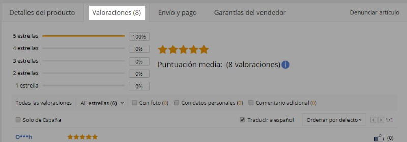
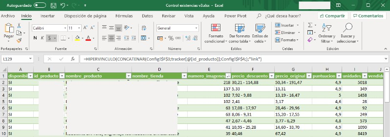

# AliCraper - AliExpress Scrapy Webscraper
So this is an AliExpress spider for Scrapy, in Python. It comes from a current personal project and it will remain as that. Therefore, what you see here is my own implementation of Scrapy for my needs. My XML feed comes from a Prestashop database. The reason I'm making this public is because other people have published their own works from which I could learn and fix my own bugs. I hope AliCraper can help you in some way, feel free to take my spider and modify it to your needs.

## What does it need?

You need [Scrapy](https://scrapy.org/) installed. If you want to use it via command line in PowerShell, for example, as I do, you need to add it to your HOME Path. I installed it using Anaconda as they recommend for Windows users. Obviously you also need Python...

## What does it scrape?

AliCraper takes all this information for a given Product ID:

| Value | Description |
| --- | --- |
| id_producto | The Product ID exactly as it is given by file. |
| nombre_producto | The long name of the product. The language will change depending on the language subdomain you specify in `crear_requests()` method. |
nombre_tienda | The name of the store. |
precio_original | Original price without discounts |
precio_descuento | Price with discount. With ranges it will appear as a string like '23,4 - 67,3'. 
| unidades | Number of available products to buy |
| puntuacion | Average rating |
| votos | Number of ratings |
| vendidos | Number of products sold |
| Disponibilidad | Availability tracker based on errors like 404 and 'offline' tagged product |
| numero_imagenes | Number of clients feedback images |
 

## What does it do?

The standard flow goes like this:
 
1. AliCraper opens a file you have created with a unique AliExpress Product ID in each line

2. `crear_requests` iterates through each ID to construct a valid AliExpress product link and adding each Request to an array which must be returned in order for the Spider to start iterating through. Each Request has the Product ID attached as a meta value in order to access it in the parse method. 

3. `parse()` is called for each Product ID link, storing the base details of the product. If the product is not available anymore (404 status), Scrapy's default behaviour is to omit this information. AliCraper will handle this status code and include an empty item with Disponibilidad = '404'.

4. Product pages have an iframe which shows the reviews and the number of feedback images. I needed to know how many of these images each product had, but an iframe is a different HTTP request, so at the end of the `parse()` method, it will make a new request after setting up the iframe url, adding it to the same product in `parse_imagen()` method.

5. After all iterations, Scrapy will save everything in the file you've selected at command line.

---

So, in few words:
 
This spider takes a list of AliExpress IDs like: 
>As an example, and inside root folder: lista_temp.txt

    32962296185
    32856417509
    32829758099
 
Transforms them in valid AliExpress URLs:

    https://es.aliexpress.com/item/-/32962296185.html
    https://es.aliexpress.com/item/-/32856417509.html
    https://es.aliexpress.com/item/-/32829758099.html

Fetches via HTTP Requests each page, storing all the items listed in `AlicraperItem` class inside `items.py` including the number of feedback images, which is only available after a second HTTP request because it's inside an iframe that Scrapy can't handle normally.

## How should I use it as it is?

For debugging purposes, I have two different ways of feeding a file with all the Product IDs: *Via XML* or *Via TXT* 

Fast cheat sheet when you feel lazy:  
>With final filename XML: `tracker.csv` and testing TXT: `lista_temp.txt

XML No debug, Fresh clean file output:

    scrapy crawl alicraper -o tracker.csv -a debug=0 -a borrar=1

XML No debug, append results to previous generated feed

    scrapy crawl alicraper -o tracker.csv -a debug=0 -a borrar=0

TXT Debug, don't use borrar as argument:

    scrapy crawl alicraper -o test.csv -a debug=1

### Via XML

If `debug = 0`, AliCraper will use `xml.etree.ElementTree as ET` to iterate through `ps_product.xml`, exported from a MySQL database of a Prestashop store. In your SQL Query, make sure to  select only the unique (DISTINCT) values of the 'reference' column. Take a look at `ps_product.xml` because AliCraper will expect an ID in all 'column' tag values.

Open a terminal inside root folder and write `scrapy crawl alicraper -o filename_you_want.csv` where .csv can be any format Scrapy supports. Read [their documentation](https://docs.scrapy.org/en/latest/topics/feed-exports.html) to know more.

Scrapy doesn't delete your previous feed, it appends it. In case you want to have a fresh feed everytime, use `scrapy crawl alicraper -o filename_you_want.csv -a borrar=1` but keep in mind it will delete `tracker.csv` because it's the name of the file I use. Modify it accordingly.

As long as you modify how the spider gets your list of Product IDs, you can use any kind of XML, of course.

### Via TXT

Set `debug = 1`.

I use this method to test with a small number of Product IDs and I suggest you to do so too.

Just place a TXT file with a Product ID in each line, adjust the name accordingly to let the spider open it and that's it. In case you know you are going to use the spider repeatedly, I recommend using an automated way of updating the file with all the IDs, such as using SQL exports directly from a database, instead of building each time a clean TXT file.

The command is the same but modifying the end filename: `scrapy crawl alicraper -o temp_filename_you_want.csv`

## What to do after?

Whatever you want! In my case I've created a tracking Excel file with a table connected to the file `tracker.csv`, so everytime I run the spider and it finishes I just have to click a button to have the table updated.

## FAQ

### F\*, is that spanish?
Yep. I have the bad habit of mixing my native language with english. But you are important enough for me to write this readme in english. With Google translator you can replace everything as you want so go for it!

### You really messed up the types, numbers as strings?
Exactly. For example, when the product have variations, the showed price is something like '43,2 - 89,4', but I didn't separated it with regex because I don't need to, for now. I need to be able to see the range, but I won't do anything else with that element, like calculations, so having it as strings is fine. Same for other values, because even though I use excel to automatically format the results, I prefer to have it transformed out of the box and only add a bit more later.

### What about product variations?
AliCraper does not support them, it will scrape the default item/range, exactly as you see it if you go yourself to the product page. The spider is not smart enough. I'd love to improve it over time, and if you develop new features and want to share them, please contact me.

### Bad structure, bad documentation, no good practices...
I know. I'm not a professional programmer, this is my first 'serious' project with python, and it's only one class. It works, it does what I need, and I love it.

## License
Distributed under the MIT License.

## Contact
Send your suggestions or any other message to <victor@victorvollbrecht.com>
